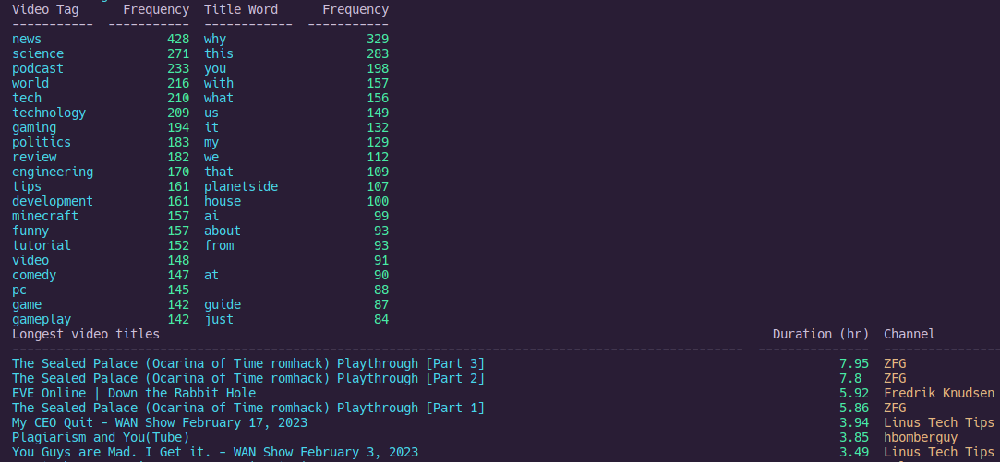

# yt-wrapped

1. Get APIv3 Youtube key [as described here](https://www.reddit.com/r/youtube/comments/13ron9q/calculating_ones_total_watch_time_and_amount_of/). (Note that this is a different tool than mine, just a good guide to getting the key.)
2. Copy `api_keys_template.json` -> `api_keys.json` and enter your API key
3. Ensure you are running at least Python 3.10, or if not, replace `@dataclass(slots=True)` with `@dataclass`
4. `pip install -r requirements.txt`
5. `python processData.py` - this will compile all your watch history into `watch_history.json`
6. To view tables/generate plots, run `python analyzeData.py`
